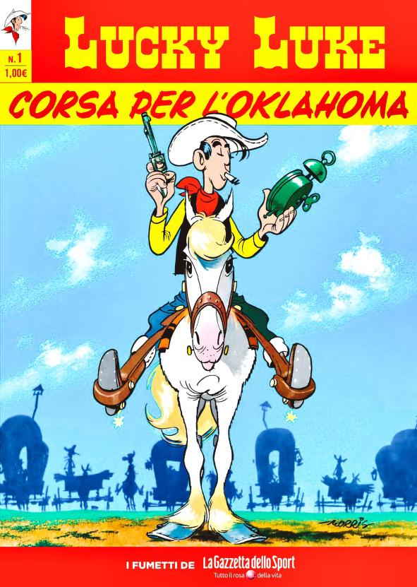

# Lucky Luke

Welcome to **Lucky Luke**! 🌟 This project is a blend of 3D modeling and cutting-edge web technologies to create an immersive scene that showcases the power of modern web development. I have used React Three Fiber, Drei, and more to bring this scene to life. Dive into the world of Lucky Luke Partner!

## 🚀 Features

- **3D Modeling:** Models Created using Blender.
- **React Three Fiber:** A powerful React renderer for Three.js, making it easier to build and manage 3D scenes in a declarative way.
- **Drei:** Essential helpers for React Three Fiber to simplify the creation process and add extra magic to this project.
- **Post processing** Depth of field, bloom, Noise, and Vignette used from @react-three/postprocessing
- **Interactivity:** Engage with the scene using orbit controls!

## 🎨 Tech Stack

- **React Three Fiber:** [react-three-fiber](https://github.com/pmndrs/react-three-fiber)
- **Drei:** [@react-three/drei](https://github.com/pmndrs/drei)
- **Three.js:** [three.js](https://threejs.org/)

## 💡 Inspiration

Lucky Luke is inspired by the idea of merging 3D modeling with the power of modern web technologies and classic art.
